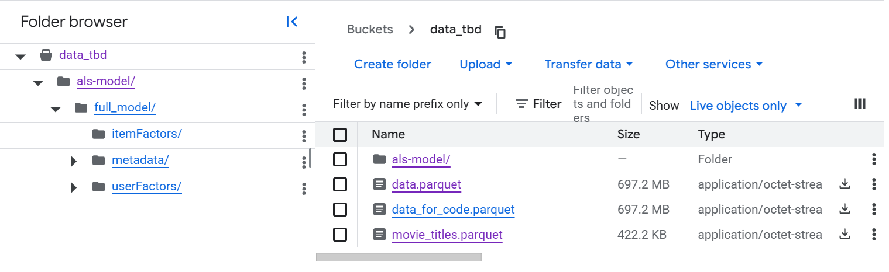
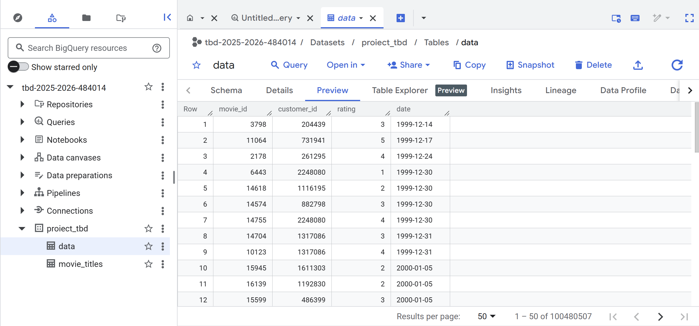
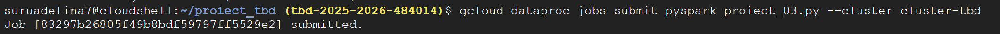
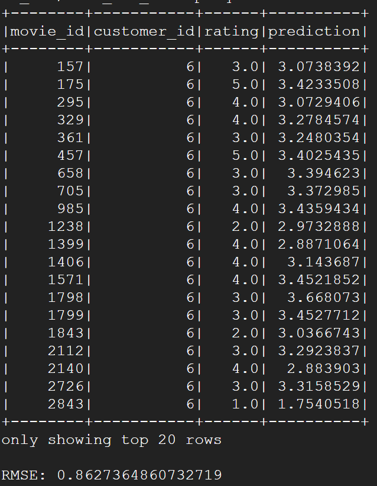
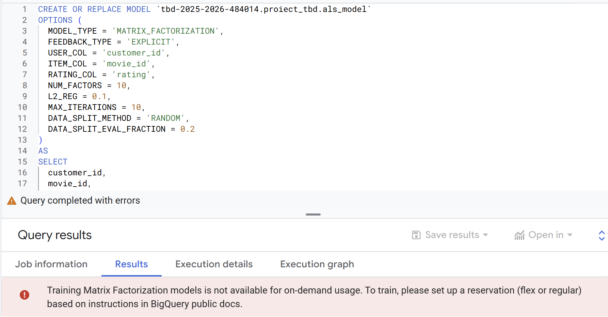

<h1>Proiect TBD - netflix prize data </h1>  
<h2>Colectarea si pregatirea datelor:</h2>  
Pentru colectare am descarcat datele folosit kagglehub. Setul de date contine 4 fisiere de tip txt numite combined_data_* ce cuprind informatii despre id ul filmului, id ul customerului, ratingul oferit si data; un fisier csv cu informatii despre id ul filmului, anul aparitiei si titlul. Setul de date mai contine si doua fisiere pentru test, fara label, probe.txt si qualifying.txt.  
Pentru pregatirea datelor am utilizat pandas. Deoarece fisierul csv pentru coloana de titles nu avea "" a fost nevoie de o procesare pentru a asigura integrarea tuturor datelor (cu incarcare direct in pandas cu read csv unele titluri erau impartite din cauza prezentei virgulei in titlu).
Am deschis fisierul cu with open pentru citire si apoi am split uit liniile pe baza virgulei, in cazul in care lista generata avea mai mult de 3 coloane, am facut join pentru a avea titlul filmului corect.  
In urma procesarii am incarcat datele intr-un dataframe cu 3 coloane. Pentru coloana year of release au existat valori NULL pe care le am eliminat, iar mai apoi am convertit coloana la int.
Dupa eliminarea valorilor null am incarcat datele in parquet.  
Pentru fisierele combined_data am folosit un for loop pentru a le procesa impreuna. Structura fisierului este urmatoarea: o linie cu movie id urmata de caracterul ":" apoi urmatoarele linii reprezinta informatia customer id, rating si date pentru acel movie_id. 
Am parcurs fisierul si am creat df rows pentru a include informatia de movie id la nivelul fiecarui rand apoi le am adaugat intr un dataframe.  
Fisierele nu au missing data, ultimul pas a fost convertirea la un format numeric, respectiv de tip data pentru coloana "date" si incarcarea intr-un fisier parquet.
 
<h2>Stocarea datelor:</h2>  
Pentru a stoca datele am utilizat Google Cloud Storage și Big Query. Am creat un bucket (https://console.cloud.google.com/storage/browser/data_tbd) și am adăugat cele două fișiere parket.  

Următorul pas a fost creare unui Dataset în BigQuery (https://console.cloud.google.com/bigquery?ws=!1m4!1m3!3m2!1stbd-2025-2026-484014!2sproiect_tbd). Pentru crearea acestuia am utilizat aceeași regiune ca pentru bucket. Apoi am creat două tabele, unul pentru fiecare fișier. În cadrul fișierului data.parquet coloana date este de tip datetime64, dar în BigQuery în schema era perceput ca INTEGER și în preview erau numere foarte mari așa că am convertit coloana la formatul 'date' și am regenerat și reîncărcat fișierul parquet.  
  
<h2>Constructia scenariilor de analiza:</h2>  
Pentr obiectivul am ales aplicarea unui model de invatare automata: <b>ALS</b> - Alternating Least Squares. Algoritmul este o metoda de factorizare a matricii, acesta utilizeaza doua matrici una pentru useri si una pentru itemi (in cazul nostru filme). Algoritmnul functioneaza iterativ, fixeaza matricea item uri si calculeaza cea mai buna matrice pentru utilizatori, apoi fixeaza matricea pentru utilizatori si se calculeaza matricea pentru item uri.  
Primul pas a fost antrenarea modelului local. Am creat o sesiune Spark, am incarcat setul de date "data_for_code.parquet" intr-un dataframe si am pastrat doar coloanele customer_id, movie_id si rating. Am selectat un esantion de 5% de utilizatori si am filtrat datasetul doar pentru acei utilizatori pentru a nu antrena modelul pe tot setul de date. Am impartit sample-ul obtinut in antrenament si test (80% training, 20% test). Am creat modelul ALS utilizand drop pentru coldStartStrategy (daca algoritmul intalneste un user sau film nevazut in antrenament dam drop), apoi am definit parametrii cu care o sa fie antrenati modelul folosind rang [10, 100] (numarul de factori latenti), regParam 10 (coeficientul de regularizare) si numarul de iteratii maxIter 10. Urmatorul pas a fost definirea evaluatorului, am utilizat RMSE. Cel mai bun model a fost cel cu Rank 10, iar valoarea pentru RMSE este 0.88026.  
Urmatorul pas a fost crearea unui cluster in Dataproc Google Cloud. In Cloud Shell am clonat repository-ul de git si am pornit pentru tot setul de date.  
  
  
Asa cum se observa si din imaginea de mai sus, RMSE scade putin pentru intreg setul de date: 0.8627. Dupa antrenare am salvat modelul intr-un Bucket.  
Am vrut sa antrenez acelasi model folosind BigQuery pentru comparatie, dar cum se observa din imaginea de mai jos, nu este disponibil fara rezervare.  
  

